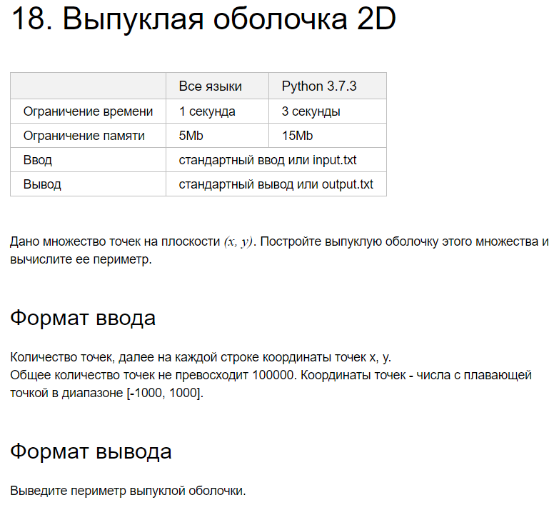

# Задача 19. Поиск точек в прямоугольнике

На вход подаются точки и прямоугольники. 
Точка задается двумя координатами (x, y). 
Прямоугольник - четверкой чисел [left, bottom, right, top]. 
Точка (left, bottom) - принадлежит прямоугольнику, точка (right, top) - нет. (left < right, bottom < top) 
Для каждого прямоугольника нужно вывести, сколько добавленных точек он содержит.

X  в диапазоне [-180, 180)
Y -  [-90, 90)
Количество точек <= 100000, Количество прямоугольников <= 1000 
Для решения задачи необходимо реализовать алгоритм “Geohashing”.
### Формат входного файла

Количество точек N. Далее N строк с координатами точек (x пробел y). 
Далее количество запросов M. Прямоугольники в виде 4 координат.  

### Формат выходного файла

Количество точек в каждом прямоугольнике

